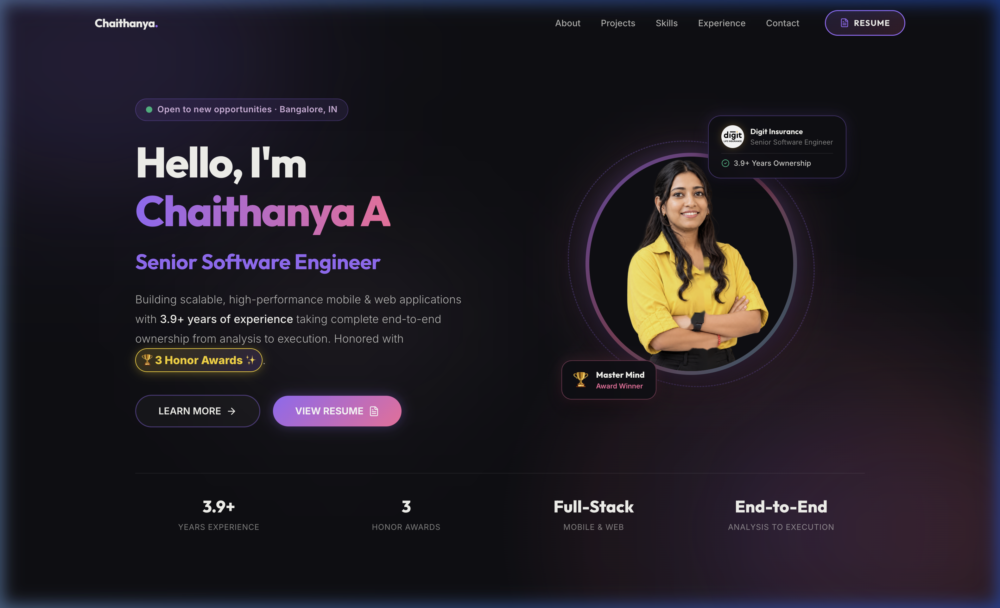

# Chaithanya A - Portfolio 🚀

A high-performance, interactive 3D portfolio website built with Next.js 16, TypeScript, Tailwind CSS, and Framer Motion.

## 🔗 Website Preview

👉 **[https://chaithanya-git-it.github.io/My_Portfolio_website/](https://chaithanya-git-it.github.io/My_Portfolio_website/)**

<div align="center">
  <br />
  <a href="https://chaithanya-git-it.github.io/My_Portfolio_website/">
    
  </a>
</div>

---

## 👨‍💻 About Me

**Senior Software Engineer** with **3.9+ years of experience** at **Digit Insurance**. Honored with the **Master Mind Award** and **Tech Titan Award** for taking complete end-to-end ownership—from requirement analysis and backend architecture planning to production execution and release.

- 🏆 **Master Mind Award Winner**: Automated pension payout & facial/liveliness verification (ML Kit + Speech-to-Text).
- 🏆 **Tech Titan Award Winner**: Zero-delay micro-frontend architecture migration using Re.Pack.
- 📱 **Mobile & Web Leadership**: End-to-end Life Insurance Endorsement suite and cross-platform native modules.

---

## 🛠️ Tech Stack

- **Framework**: [Next.js 16](https://nextjs.org/) (App Router & Static Export)
- **Language**: [TypeScript](https://www.typescriptlang.org/)
- **UI & Styling**: [React 19](https://react.dev/), [Tailwind CSS v4](https://tailwindcss.com/)
- **Animations**: [Framer Motion](https://www.framer.com/motion/)
- **Icons**: [Lucide React](https://lucide.dev/), [React Icons](https://react-icons.github.io/react-icons/)
- **Deployment**: [GitHub Actions](https://github.com/features/actions) -> [GitHub Pages](https://pages.github.com/)

---

## 💻 Getting Started

Follow these steps to run the project locally:

### Prerequisites

- **Node.js**: `v20.x` or higher
- **npm**: `v10.x` or higher

### Installation & Development

```bash
# Clone the repository
git clone https://github.com/chaithanya-git-it/My_Portfolio_website.git

# Navigate into the project folder
cd My_Portfolio_website

# Install dependencies
npm install

# Run development server
npm run dev
```

Open [http://localhost:3000](http://localhost:3000) with your browser to view the site.

---

## 🚀 Build & Production Export

```bash
# Build static export
npm run build
```

The compiled output will be generated inside the `./out` directory.

---

## ⚙️ Deployment

This project deploys automatically to **GitHub Pages** via GitHub Actions on every push to the `main` branch using the [.github/workflows/deploy.yml](.github/workflows/deploy.yml) workflow.
